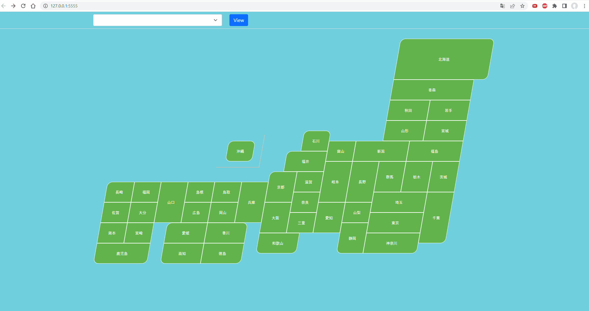
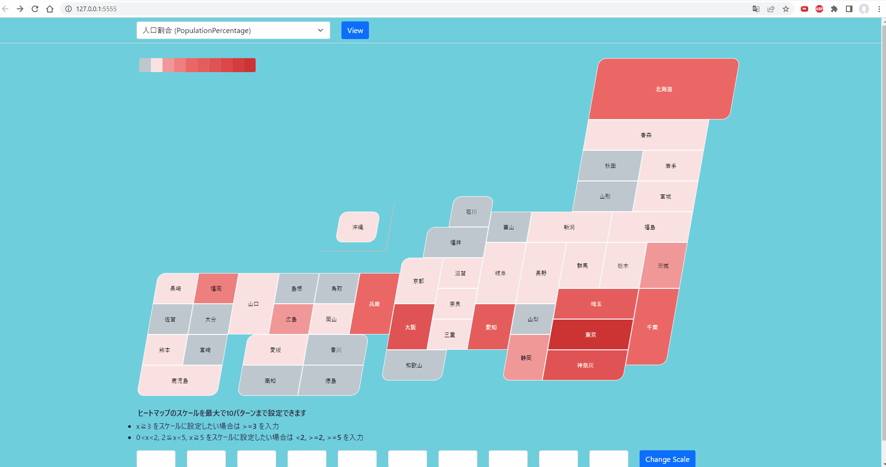

# 統計量可視化マップ(Statistics Visualization Map)
Wikidataから取得可能な各県の統計量を日本地図上で可視化できるアプリケーション  
An application that allows you to visualize the statistics for each prefecture available from Wikidata on a map of Japan  


## 使い方(Usage)
1. `index.html`をダブルクリックしてアプリケーションを起動する  
Double-click index.html to launch the application  
2. 左上のメニューから可視化したい統計量を選択し、`View`をクリックすると統計量が地図上に反映される  
Select the statistic you want to visualize from the menu in the upper left corner and click `View` to reflect the statistic on the map.  

1. 県にマウスカーソルを重ねると統計量が確認できる  
Hover the mouse cursor over a prefecture to see statistics.  

1. 県をクリックすると詳細な情報が確認できる  
Click on a prefecture for more information.  

1. ヒートマップのスケールを変更することもできる  
The scale of the heatmap can also be changed   


## 利用したライブラリ
* [Jmap jQuery plugin](https://yugokimura.github.io/jmap/)


## クエリ(参考)
### 都道府県の人口数
最新の人口のみを取得する
```
SELECT ?prefectureLabel ?year ?population ( round (?population / ?japanPopulation * 1000) / 10 AS ?percentage )
WHERE {
  ?prefecture wdt:P31 wd:Q50337;
              wdt:P1082 ?population.
  ?prefecture p:P1082 [pq:P585 ?year].
  wd:Q17 wdt:P1082 ?japanPopulation.
  
  FILTER NOT EXISTS {
    ?prefecture wdt:P31 wd:Q19953632.
  }
  FILTER (?prefecture = ?p && ?year = ?recentYear)
  {
    SELECT ?p ( MAX(?y) as ?recentYear)
    WHERE {
     ?p wdt:P31 wd:Q50337.
     ?p p:P1082 [pq:P585 ?y].
    FILTER NOT EXISTS {
      ?p wdt:P31 wd:Q19953632.
    }
    }
    GROUP BY ?p
  }
  SERVICE wikibase:label { bd:serviceParam wikibase:language "[AUTO_LANGUAGE],ja". }
}
```

### 都道府県の最高点
最高点となる山とその標高を取得する
```
SELECT ?prefectureLabel ?mountainLabel ?high
WHERE {
  ?prefecture wdt:P31 wd:Q50337;
              wdt:P610 ?mountain.
  ?mountain wdt:P2044 ?high.
  FILTER NOT EXISTS {
    ?prefecture wdt:P31 wd:Q19953632.
  }
  SERVICE wikibase:label { bd:serviceParam wikibase:language "[AUTO_LANGUAGE],ja". }
}
```

### 都道府県の面積
面積を取得する
```
SELECT ?prefectureLabel ?area 
WHERE {
  ?prefecture wdt:P31 wd:Q50337;
              wdt:P2046 ?area.
  
  FILTER NOT EXISTS {
    ?prefecture wdt:P31 wd:Q19953632.
  }
  SERVICE wikibase:label { bd:serviceParam wikibase:language "[AUTO_LANGUAGE],ja". }
}
```